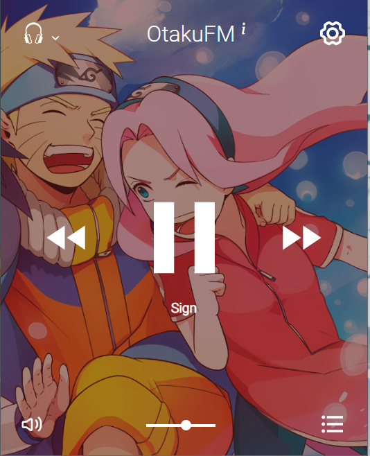

# Otakufm
OtakuFM is a web 'radio' for listening to Japanese anime music.

## Connect
<a href="https://twitter.com/lanre_olaleru"></a>
<a href="mailto:larryolaleru@outlook.com"></a>
<a href="https://www.linkedin.com/in/lanre-olaleru-79a12923a/"></a>

## Installation
Use [node](https://nodejs.org/en/download/) v16 and above preferably.

```bash
cd otakufm && yarn dev
```
## Features

<ol>
  <li> Choose your station using the headphone icon</li>
  <li> Enjoy a list of all songs from your selected playlist </li>
  <li> Play, forward and go back to selected track </li>
</ol>

## Contributing

Pull requests are welcome. For major changes, please open an issue first
to discuss what you would like to change.

## License

[MIT](https://choosealicense.com/licenses/mit/)
